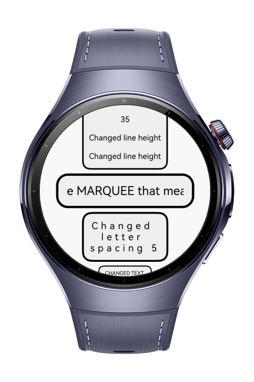
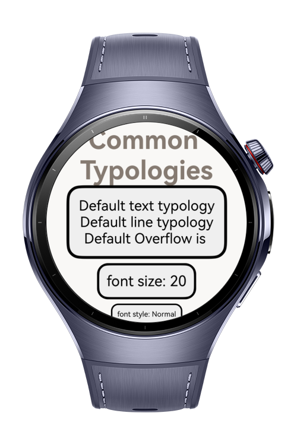

> **Note:** To access all shared projects, get information about environment setup, and view other guides, please visit [Explore-In-HMOS-Wearable Index](https://github.com/Explore-In-HMOS-Wearable/hmos-index).

# How to Apply Text Typography

This HarmonyOS Codelab demonstrates the  Text component and its most common typography attributes. 
User can explore these attributes by clicking the buttons and instantly see how each change affects the appearance in real time.
It also helps developers better understand the impact of typography, enabling them to create 
more consistent and visually appealing designs in their own projects.

# Preview

<div>
  
  
  
  
</div>

# Use Cases
- Previewing typography variations: Quickly test different font sizes, weights and styles to se how they effect readability.
- Design Fine-Tuning: Adjust text appearance in real time to create a consistent visual hierarchy.
- Developer Learning: Understand how HarmonyOS Text attributes behave and interact without writing additional code.


# Technology

## Stack
- **Languages**: ArkTS, ArkUI
- **Frameworks**: HarmonyOS SDK 6.0.0(20)
- **Tools**: DevEco Studio Version 6.0.0
- **Libraries**:
    - `@kit.ArkUI`
    - `@kit.AbilityKit`
    - `@kit.BasicServicesKit`
    - `@kit.PerformanceAnalysisKit`


# Directory Structure

```
entry/
├── src/main/ets/
│ ├── datasources/
│ │ ├── DataEdit.ets
│ │ └── MainData.ets
│ │
│ ├── entryability/
│ │ └── EntryAbility.ets
│ │
│ ├── entrybackupability/
│ │ └── EntryBackupAbility.ets
│ │
│ ├── model/
│ │ └── TextModel.ets
│ │
│ ├── pages/
│ │ ├── Index.ets
│ │ └── MainScreen.ets 
│ 
```

# Constraints and Restrictions
## Supported Devices
- Huawei Watch 5
- DevEco Studio Simulator

# License

**How to Apply Text Typography** is distributed under the terms of the **MIT License**.

• See the [LICENSE](LICENSE) for more information
